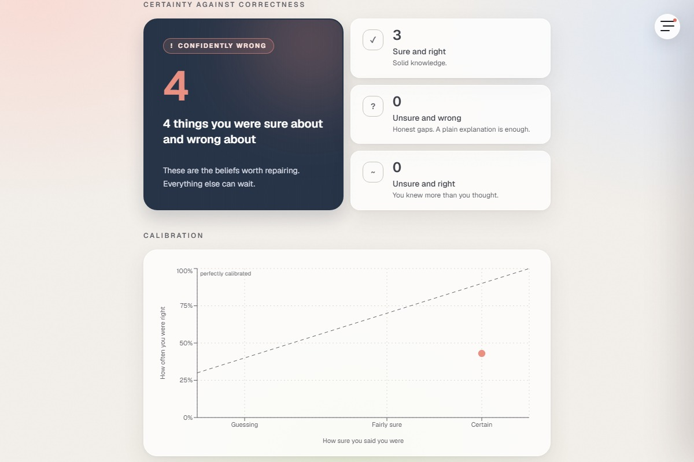
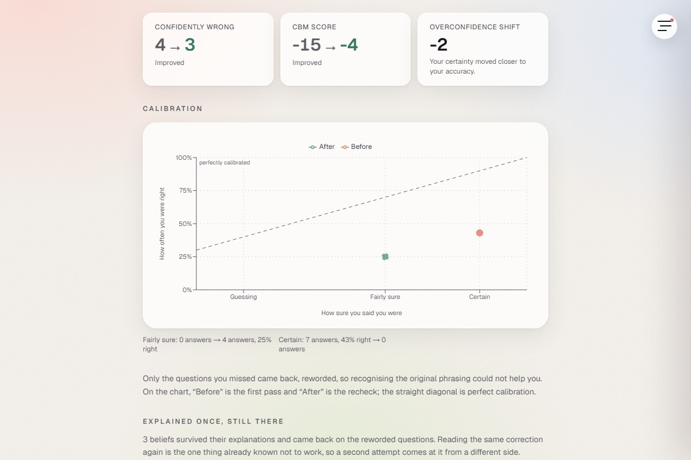

<div align="center">

# Confidently Wrong

**Study the things you're _sure_ about.**

[**Live app**](https://confidently-wrong-fawn.vercel.app) · [Accessibility](docs/accessibility.md) · [Performance](docs/performance.md) · [Failure modes](docs/failure-modes.md)


</div>

Answer unstudied material, state your certainty; only what you were _confidently wrong_ about gets refuted. **Certainty-based marking.**

## The five phases

| Probe | Reveal | Repair | Recheck |
| :--: | :--: | :--: | :--: |
|  |  |  |  |
| certainty, no feedback | quadrants, calibration, CBM | the confidently-wrong quadrant | reworded misses |

## Why refutation is gated

Certainty 2 or 3 _and_ wrong earns a refutation; a guess gets a plain correction, because refuting an unheld belief plants it. `lib/scoring.ts`

## When the explanation does not land

A belief that comes back on the reworded question is the most informative thing in a session: the correction was read, understood well enough to answer with, and rejected. Reading it again is the one thing already known not to work, so the second attempt switches style and says which style it switched to. There is no third. The app names the two sentences worth taking to a person and stops, because a model that has failed twice on one misconception is not one wording from success. `lib/escalation.ts`

## What it thinks you believe

Certainty is evidence, not a multiplier: each answer updates a posterior over which misconception you hold. Certain-and-wrong moves it hard, a guess barely. The next question maximises information gain. `lib/belief.ts`

A belief you held last week is still suspected this week. Each session leaves one note per concept, halving in weight every 30 days, and history is capped at 0.6 of the prior and cannot drive any hypothesis to zero: what you believed tilts the opening question, what you answer decides it. A run never primes itself. `lib/memory.ts`

## Your own material

`/packs/new` turns a PDF or notes into questions, every distractor a named misconception; uploads deleted. Endless mode starts you after three and writes the rest in the background while you answer, so you stop on a number you choose. `/explain` marks a spoken explanation, then quizzes the misses.

## Refutations that cite your notes

The generator already makes the model quote the span of your material that settles each question, and verifies the quote against the source. Repair got none of that, so the explanation of why your belief was wrong came from what the model knew, and where that disagreed with your notes it told you your notes were wrong. Now the passage is retrieved and sent with the request: BM25 over every passage, in the browser, because that is the only place the material lives and the body is capped at 4KB, then embeddings reorder the three that fit. Share fewer than two content words with the question and a passage is not a candidate at all, so material that does not cover it grounds nothing rather than quoting the least irrelevant paragraph. The line under the refutation is the passage it was written from, attached by the route rather than claimed by the model. `lib/retrieval.ts`

## What to study next

`/dashboard` opens with at most five steps, strongest evidence first: a belief history says you are still holding, then a topic missed while certain, then a certainty gap of ten points or more, then something you had right and have not been asked in two weeks. Every step states the numbers that produced it, and nothing is offered that the app cannot do. Weak topics, the calibration curve and every run are below it. `lib/plan.ts`

## Question quality

`lib/quality.ts` fails a stem that leaks its answer, or a visibly longest correct option. Form checks cannot see a false key, so `lib/challenge.ts` answers each question blind to it. Word overlap cannot see a reworded question, so `lib/similarity.ts` compares stem embeddings, at a threshold swept over 18 labelled pairs. `npm run eval` on the committed run: 15 questions kept, 15 of 15 with a verified source span, 4 thrown out by the blind second opinion, 4 more as paraphrases the embeddings caught. [Report](evals/report.md)

## Does the targeting work

Recruiting learners was not possible, so `npm run sim` runs twelve personas through three packs, eight draws each: 288 runs, no model calls. The personas answer; the app's own selection, gating, and scoring do everything else. Two honest numbers. The belief model named the exact misconception on 81% of confidently wrong answers, ground truth drawn from the space it searches. And gating declines 23% of the refutation calls while keeping 95% of the corrections. The correction assumption is swept from 0 to 1, and at 0 every policy ties, which is the null. [Report](sim/report.md) · [what it cannot say](sim/README.md)

## Stack

Next.js App Router, strict TypeScript, Tailwind, Zustand + `localStorage`, Recharts, Vitest. `ministral-3b-latest` writes refutations and packs, `mistral-embed` re-ranks retrieved passages and catches reworded questions, `mistral-ocr-latest` reads PDFs, Voxtral does speech. No database; every AI path has a fallback.

```bash
npm install
cp .env.example .env.local
npm run dev
npm test
```

`npm run a11y` · `failures` · `perf` · `eval` · `sim` · `shots` regenerate `docs/` and `evals/` against a running build; nothing there is hand-written.

## Sources

- Gardner-Medwin, A. R. — certainty-based marking, UCL; in summative medical exams since 1994.
- Butterfield, B., & Metcalfe, J. (2001) — hypercorrection.
- Richland, Kornell & Kao — the pretesting effect.
- _Educational Psychology Review_ (2026), DOI 10.1007/s10648-026-10116-9 — personalised refutation can backfire.
